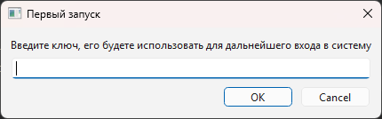

Программа для хранения паролей.
Для входа использует мастер ключ, который вы задаете при первом запуске программы.
Сам ключ нигде не хранится, используется его слепок алгоритмом sha256.

Программа имеет настройки, которые хранятся в файле 'C:\Users\user\AppData\Roaming\KAS\PasswordManager\config.json'

структура конфига:
```json
{
    "db_name": "passwords.db",
    "public_hash_key": "9f677c1fcfdacb7a2cc30aaebe1820bcc9b71d177205385e4be4973938d01370",
    "salt": "IO9MXx/QQfS7GXPDjPzsTykYXB6XmIrBnCFOj/dE/No="
}
```
- `db_name` - имя базы данных SQLite, где хранятся данные
- `public_hash_key` - публичный мастер ключ, сгенерированный из вашего пароля и сгенерированной соли (не из поля 'salt').
- `salt` - соль использующая в алгоритме шифрования паролей. Конечно не в чистом виде.

Первый вход:
